<div align="center">
  
</div>

<br/>

```
$ ls stack/
```

| Shopify | Frontend | Apps |
|---|---|---|
| Liquid · Sections & Blocks · Theme performance | JavaScript · HTML · CSS | React · Next.js · Shopify APIs |

<br/>

```
$ ls projects/ --featured
```

| | |
|---|---|
| **[de-leville](https://github.com/SantiagoGX/de-leville)** | Shopify theme & app |
| **[kwara-mx](https://github.com/SantiagoGX/kwara-mx)** | Custom Shopify theme |
| **[serenity-candle-haus](https://github.com/SantiagoGX/serenity-candle-haus)** | Custom Shopify theme |
| **[jack-turner](https://github.com/SantiagoGX/jack-turner)** | Custom Shopify theme |

<br/>

```
$ cat contact.txt
```

> **Email** → [santiagosalinascorp@gmail.com](mailto:santiagosalinascorp@gmail.com)
> **LinkedIn** → [linkedin.com/in/santiagosalinasin](https://www.linkedin.com/in/santiagosalinasin)

<br/>

<div align="center">

</div>
